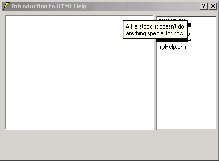

<div align="center">

## HTML Help and VB


</div>

### Description

This tutorial will learn you how to combine HTML Help with VB, so your applications can easily have functions like "Whats this help" and "context sensitive help". This tutorial is fully illustrated, (17 images), everything done nicely step by step. VB6 is REQUIRED. This will not work with older versions.
 
### More Info
 


<span>             |<span>
---                |---
**Submitted On**   |2002-04-02 15:51:10
**By**             |[Almar Joling](https://github.com/Planet-Source-Code/PSCIndex/blob/master/ByAuthor/almar-joling.md)
**Level**          |Beginner
**User Rating**    |4.9 (292 globes from 60 users)
**Compatibility**  |VB 6\.0
**Category**       |[Miscellaneous](https://github.com/Planet-Source-Code/PSCIndex/blob/master/ByCategory/miscellaneous__1-1.md)
**World**          |[Visual Basic](https://github.com/Planet-Source-Code/PSCIndex/blob/master/ByWorld/visual-basic.md)
**Archive File**   |[HTML\_Help\_770154292002\.zip](https://github.com/Planet-Source-Code/almar-joling-html-help-and-vb__1-34214/archive/master.zip)


### Source Code

```
The tutorial is too big to put here... That's why I've included it with the zipfile, including sample source files, and the files I used to build the HTML help file.
<P>
<I>Guys, this tutorial was removed two days ago, probably by the hacker who has visitted this tutorial. Ian Could not restore the tutorial, so can you guys <B>please</B> vote for this another time? It had about 30+ Excellent votes =-(</I>
<P>
Thanks,<BR>
Almar Joling
```

